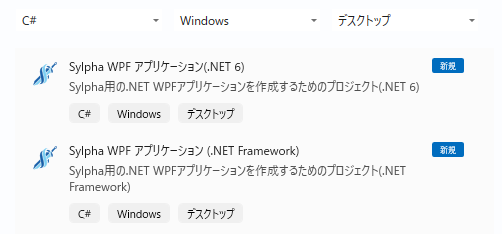
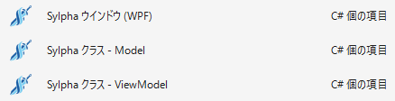

# Sylpha

[English version is here.](README_en.md)


Sylpha(シルファ) は [Livet](https://github.com/runceel/Livet) を元に作成した WPF のための MVVM(Model/View/ViewModel) パターン用インフラストラクチャです。  
.NET Framework 4.6.2 / 4.8 以上及び .NET 6 / 8 / 9 / 10 以上で動作します。  
Visual Studio 2026 , C#14 以降の使用を推奨します。

## 導入
NuGet に公開しています。

- [Sylpha](https://www.nuget.org/packages/Sylpha/)

または、一部の機能を利用したい場合に対応するため、機能単位のパッケージを提供しています。  
- [Sylpha.EventListeners](https://www.nuget.org/packages/Sylpha.EventListeners)
- [Sylpha.Messaging](https://www.nuget.org/packages/Sylpha.Messaging)
- [Sylpha.Messaging.Extensions](https://www.nuget.org/packages/Sylpha.Messaging.Extensions)

#### 依存関係


### Visual Studio 対応

Sylpha は Livet と同様に Visual Studio の拡張機能を提供します。  
拡張機能では、プロジェクトテンプレート、アイテムテンプレート、コードスニペットを提供しています。  
[Sylpha (Visual Studio Extensions)](https://marketplace.visualstudio.com/items?itemName=kttFox.Sylpha)


#### プロジェクトテンプレート

- Sylpha WPF アプリケーション(.NET6)
- Sylpha WPF アプリケーション(.NET Framework)

#### アイテムテンプレート

- Sylpha ウインドウ (WPF)
- Sylpha クラス - Model
- Sylpha クラス - ViewModel


#### コードスニペット
- scom : DelegateCommand
- scomn : DelegateCommand ( CanExecute なし )
- scomx : DelegateCommand&lt;T&gt; ( パラメータあり )
- scomxn : DelegateCommand&lt;T&gt; ( パラメータあり, CanExecute なし)
- sprop : Notification Property（変更通知プロパティ）

field キーワードを使用します。

## View サポート

Sylpha のViewでの名前空間は `http://schemas.sylpha.com/wpf/mvvm` になります。
```xml
<Window
	xmlns:s="http://schemas.sylpha.com/wpf/mvvm">
```

### MessageAction

Sylpha の Messenger などから送られたメッセージを受け取ることの出来る MessageAction が用意されています。  
この MessageAction は Messenger からメッセージを受け取るだけではなく、EventTrigger などから MessageAction を起動することが出来るようになっています。  
これにより、クリックイベントなどをきっかけにして別ウィンドウを表示したり、メッセージボックスを出したりといったことが View の Xaml のみの記述で行えます。

また、戻り値のあるメッセージ（MessageBoxMessageなど）では、その戻り値を引数に渡して ViewModel のメソッドやコマンドの呼び出しにも対応しています。

#### CallMethodAction
メソッドの呼び出しを行います。  
対応する型のメソッドをリフレクションにて検索します。

CallMethodAction を使用するとイベントに対してメソッドの呼び出しが可能になります。

#### View のイベントから ViewModel のメソッドを呼ぶアクション

MethodParameterプロパティを使用してメソッドに 1 つの引数を渡すことが出来ます。  
**Sylpha では MethodParameter に Null を渡したい場合、型情報を付与するために MethodParameterType プロパティを追加しています。**

```xml
<Button Content="Call ViewModel method - ButtonClick with param">
	<i:Interaction.Triggers>
		<i:EventTrigger EventName="Click">
			<s:CallMethodAction MethodName="ButtonClick"
								 MethodParameter="TextParam"
								 MethodTarget="{Binding}" />
		</i:EventTrigger>
	</i:Interaction.Triggers>
</Button>

<!-- MethodParameterType -->
<Button Content="Call ViewModel method - ButtonClick( null )">
	<i:Interaction.Triggers>
		<i:EventTrigger EventName="Click">
			<s:CallMethodAction xmlns:sys="clr-namespace:System;assembly=mscorlib"
								 MethodName="ButtonClick"
								 MethodParameter="{x:Null}"
								 MethodParameterType="{x:Type sys:String}"
								 MethodTarget="{Binding .}" />
		</i:EventTrigger>
	</i:Interaction.Triggers>
</Button>
```
```cs
void ButtonClick( string? param ) {
	this.Text = $"[{DateTime.Now}] ViewModel - Button Clicked with param: {param ?? "null"}";
}
```

#### DirectMessage
Viewから直接メッセージを定義する際に使用します。

メッセージの定義も View で行いたい場合は MessageAction に対して [DirectMessage] -> [対応する Message] と順に指定します。  
DirectMessage を挟むことで、CallMethodAction のようにメソッドを呼ぶことが可能です。  

例えば、ボタンをクリックしたら確認ダイアログを出す場合は以下のようになります。
```xml
<Button Content="MessageBoxFromView">
	<i:Interaction.Triggers>
		<i:EventTrigger EventName="Click">
			<s:MessageBoxMessageAction>
				<s:DirectMessage CallbackMethodName="MessageBoxFromView" CallbackMethodTarget="{Binding}">
					<s:MessageBoxMessage Caption="テスト" Text="これはテスト用メッセージです。" />
				</s:DirectMessage>
			</s:MessageBoxMessageAction>
		</i:EventTrigger>
	</i:Interaction.Triggers>
</Button>
```
上記の例では、MessageAction の実行後に ViewModel の MessageBoxFromView メソッドを呼ぶように指定しています。  
MessageBoxFromView メソッドでは MessageBoxMessage を引数に受け取り処理を行えます。

```cs
public void MessageBoxFromView( MessageBoxMessage message ) {
	OutputMessage = $"{DateTime.Now}: MessageBoxFromView: {message.Response}";
}
```

### Messenger

Sylpha の Messenger は Livet と使い方は同じですが、より直感的に使えるよう改善されています。

Messenger を使用する場合は、まず View に MessageTrigger と MessageAction を指定します。

```xml
<s:MessageTrigger MessageKey="MessageKey_MsgBox" Messenger="{Binding Messenger}">
	<s:MessageBoxMessageAction />
</s:MessageTrigger>
```

そして、ViewModel 側で Messenger を使用してメッセージを送ります。

```cs
public void MessageBoxFromViewModel() {
	var message = new MessageBoxMessage( "これはテスト用メッセージです。", "テスト" ) {
		Button = MessageBoxButton.OKCancel,
		MessageKey = "MessageKey_MsgBox",
	};
	Messenger.Raise( message );
	OutputMessage = $"[{DateTime.Now}]: MessageBoxFromViewModel: {message.Response}";
}
```

MessageTriggerは MessageKey_MsgBox というメッセージキーを目印にして MessageAction 起動します。

#### Sylpha.Messaging
Sylpha に標準で定義されているアクションとメッセージの組み合わせは以下の通りです。  
|MessageAction|Message|説明|
|:---|:---|:---|
|MessageBoxMessageAction|MessageBoxMessage|メッセージボックス|
|ShowWindowMessageAction|ShowWindowMessage|画面遷移|
|OpenFileDialogMessageAction|OpenFileDialogMessage|ファイルを開く ダイアログ|
|OpenFolderDialogMessageAction|OpenFolderDialogMessage|フォルダ選択 ダイアログ ( .NET8以降 )|
|SaveFileDialogMessageAction|SaveFileDialogMessage|ファイルの保存 ダイアログ|
|WindowActionMessageAction|WindowActionMessage|ウインドウの最大化、最小化、閉じる など|
|CallMethodAction|CallActionMessage<br>CallActionMessage&lt;TResult&gt;<br>CallFuncMessage&lt;TParameter&gt;<br>CallFuncMessage&lt;TParameter, TResult&gt;|関数呼び出し|

#### Sylpha.Messaging.Extensions
Windows API Code Pack を使用しているのでパッケージが分かれています。
|MessageAction|Message|説明|
|:---|:---|:---|
|CommonOpenFileDialogMessageAction|CommonOpenFileDialogMessage|フォルダ選択 ダイアログ|

### MultiMessageAction

上記の Sylpha に標準で定義されているアクションを網羅した MultiMessageAction も作成しました。  
標準的に Window に定義しておくことで、MessageAction を設定する手間を省けます。  

MessageAction と Message が対になっているため MessageKey の必要性は低く、こちらの使用をおすすめします。

```xml
<s:MessageTrigger Messenger="{Binding Messenger}">
	<s:MultiMessageAction />
</s:MessageTrigger>
```

### Messenger 拡張メソッド
Livet では Messenger にメッセージを送るときは Messenger.Raise() もしくは Messenger.GetResponse() が基本でした。  
Sylpha では Messenger.Raise() の戻り値に 送信したMessage を返すことで Raise() に統一しています。  

さらに、各定義Message に Messenger への拡張メソッドを追加することで、Raise() をできるだけ使用しないようにしました。
```cs
// 通常
Messenger.Raise( new MessageBoxMessage( "hello" ) )

// MessageBoxMessage の拡張メソッド
Messenger.MessageBox( new MessageBoxMessage( "hello" ) )
```
この拡張メソッド達を使用することで、Raise()に渡す Messageクラスを迷うことなく、戻り値の有無も適切に判別できます。


### Initialize / DataContextDisposeAction
Livet と同様に Sylpha でも Windowクラスの初期設定で２つのイベントをサポートしています。

ContentRendered イベントに ViewModel の Initialize メソッドを設定しています。  
Livet では Initialize を用意する必要がありましたが、Sylphaでは ViewModel に virtual メソッドとして定義されているため、オーバーライドするだけで使用できます。

Closed イベントには DataContextDisposeAction を設定しています。  
ViewModel は EventListener や 他の破棄したいリソースのために DisposableCollection プロパティが用意されており、IDisposable を継承してるため、破棄する必要があります。  
この ViewModel を破棄するための設定となります。

```xml
<Window xmlns:i="http://schemas.microsoft.com/xaml/behaviors"
		xmlns:s="http://schemas.sylpha.com/wpf/mvvm">
	<i:Interaction.Triggers>
		<i:EventTrigger EventName="ContentRendered">
			<s:CallMethodAction MethodName="Initialize"
								MethodTarget="{Binding}" />
		</i:EventTrigger>

		<i:EventTrigger EventName="Closed">
			<s:DataContextDisposeAction />
		</i:EventTrigger>
	</i:Interaction.Triggers>
</Window>
```

## ViewModel サポート

### Messenger と DisposableCollectionプロパティ

Messenger は前述の View サポートで解説した通り、 MessageAction に ViewModel からメッセージを伝えるために用意されています。  
Messenger の DisposableCollectionプロパティは Collection&lt;IDisposable&gt; を継承しており、ViewModel が Dispose される際に同時に破棄したいリソースを格納するために使用されます。

ViewModel と一緒に破棄したいリソースは基本的に ViewModel の DisposableCollectionプロパティに追加する事になります。

```cs
DisposableCollection.Add( someResource );
// または
someResource.AddTo( DisposableCollection );
```

### EventListener&lt;THandler&gt;
ViewModel では Model のイベントを監視するケースが多くあります。  
しかし、C# でイベントハンドラの監視をラムダ式を使って行うと解除が出来ないという問題があります。

```cs
// 購読解除できない
var model = new Model();
model.SampleEvent += (s, e) => {
	// 処理
};
```

この問題を解消するためイベント追加・解除、ラムダ式をラッピングした、汎用 EventListener&lt;THandler&gt; を用意してあります。

```cs
var model = new Model();
var listener = new EventListener<EventHandler<SampleEventArgs>>(
	h => model.SampleEvent += h,
	h => model.SampleEvent -= h,
	(s, e) => {
		// 処理
	});

// 購読解除
listener.Dispose();
```

### PropertyChangedEventListener
プロパティ変更（INotifyPropertyChanged）のイベント用

```cs
var model = new Model(); // INotifyPropertyChanged
var listener = new PropertyChangedEventListener( model ) {
	// コレクション初期化子で指定可能
	
	// プロパティ名を指定せずに PropertyChanged イベントに対する処理
	(s, e) => { /* 処理 */ },
	
	// プロパティ名指定でイベントハンドラーを設定
	{ nameof(Model.Input1), (s, e) => { /* 処理 */ } },

	// プロパティ名を式木で設定
	{ () => model.Input2, (s, e) => { /* 処理 */ } },
};

// 個別登録も可能
listener.RegisterHandler((s, e) => { });
listener.RegisterHandler(nameof(Model.Input1), (s, e) => { });
listener.RegisterHandler(nameof(Model.Input1), (s, e) => { }, (s, e) => { }); // 複数可
listener.RegisterHandler(() => model.Input2, (s, e) => { });
listener.RegisterHandler(() => model.Input2, (s, e) => { }, (s, e) => { }); // 複数可

// 購読解除（ViewModel の破棄時に解除する場合は前述の DisposableCollection を使用
listener.Dispose();
```

### CollectionChangedEventListener
コレクション変更通知（INotifyCollectionChanged）のイベント用

```cs
var model = new Model(); // INotifyCollectionChanged
var listener = new CollectionChangedEventListener( model ) {
	// すべてのアクションでイベントハンドラーを設定
	( sender, e ) => { },

	// アクションを指定してイベントハンドラーを設定
	{ NotifyCollectionChangedAction.Add, (s,e)=>{ } },
	{ NotifyCollectionChangedAction.Add, [(s,e)=>{ }, (s,e)=>{ }] }, // 複数可
};

listener.RegisterHandler((s, e) => { });
listener.RegisterHandler(NotifyCollectionChangedAction.Add, (s, e) => { });
listener.RegisterHandler(NotifyCollectionChangedAction.Add, (s, e) => { }, (s, e) => { }); // 複数可

// 購読解除
listener.Dispose();
```

## WeakEventListener&lt;THandler, TEventArgs&gt;
Sylpha では WeakEventListener を可能な限り参照が残らないように修正しています。

- WeakEventListener&lt;THandler, TEventArgs&gt;
- PropertyChangedWeakEventListener
- CollectionChangedWeakEventListener

WeakEventListener は Dispose をし忘れたとしても事故が起こりにくく作られています。  
Weak とついているように弱参照を取り入れた EventListener です。  
イベントの対象と、イベントハンドラーの部分を弱参照にすることで、対象が解放されたときにイベントハンドラーの処理が発生しないような仕組みになります。

Livet では実際のイベントの解除まではできておらず、少しだけメモリリークのような状態になっていました。  
Sylpha の WeakEventListener では対象が解放された後に発生したイベントで解除の処理が実行されるように変更しています。

## MessageListener
Livet の時から存在していましたが、解説もなく影に隠れた存在でした。  
MessageListener は Messenger の受信イベントを検知して登録した関数を実行します。

コード上で Messenger の受信イベントを処理したい場合こちらの利用をおすすめします。
```cs
new MessageListener( messanger ) { 
	m => { /* なにか処理 */ }
 }
```

## Command
Sylpha の Command は DelegateCommand, DelegateCommand&lt;T&gt; を提供しています。  
ICommand に準拠した形になっています。  
CurrentCanExecuteプロパティは 最後の CanExecute 実行時の結果を保持します。

Sylpha 拡張機能ではコードスニペットを提供しています。
- scom : DelegateCommand
- scomn : DelegateCommand ( CanExecute無し )
- scomx : DelegateCommand&lt;T&gt; ( 引数あり )
- scomxn : DelegateCommand&lt;T&gt; ( 引数あり、CanExecute無し )


## Model サポート

Sylpha は Livet と同様に Model では NotificationObject を使用します。  
NotificationObject は ViewModel クラスにも継承されているため、ここで説明する内容は ViewModel でも使用できます。  
  
NotificationObject にはプロパティの定義を簡略化するための以下のメソッドが定義されています。

#### SetProperty
フィールドの更新と PropertyChanged イベントの発行を行います。  
このメソッドを使うとプロパティの定義は以下のようになります。  
C#14で導入された field キーワードを使用すると簡潔に記述することができます。

このプロパティの定義は、コードスニペットの sprop で生成できます。
```cs
public string MyProperty { get; set => SetProperty( ref field, value ); }
```

#### RaisePropertyChanged メソッド

プロパティ名指定で PropertyChanged イベントを発行します。

```cs
public string MyProperty {
	get;
	set {
		if( field != value ) {
			field = value;
			RaisePropertyChanged(); // CallerMemberName により自動でプロパティ名が設定されます
			
			// 明示的に指定することも出来ます。
			RaisePropertyChanged( nameof( MyProperty ) );
			RaisePropertyChanged( ()=> MyProperty );
		}
	}
}
```
または、他のプロパティのイベント発行として使います。
```cs
public string MyProperty {
	get; set {
		if( SetProperty( ref field, value ) ){
			RaisePropertyChanged( nameof( Text ) );
		}
	}
}

public string Text => MyProperty + " Changed";
```

## その他

### スレッドセーフ、UIスレッド のサポートを削除
Sylpha では スレッドセーフな処理、UIスレッドのチェック処理を削除しています。  
Livet では Command や Messenger でこの処理が行われていましたが、基本的にUIスレッドで処理されているため廃止しました。

ですので、Sylpha では Messenger へ Message を送るときは必ずUIスレッドから行ってください。

### RestoreDirectoryGroup

ファイルやフォルダを選択するダイアログで、前回開いたディレクトリを記憶する機能を追加しています。
- OpenFileDialogMessage
- OpenFolderDialogMessage ( .NET8以降 )
- SaveFileDialogMessage
- CommonOpenFileDialogMessage ( Sylpha.Messaging.Extension )

Message の RestoreDirectoryGroupプロパティ に文字列でキーを設定すると、確定したダイアログのディレクトリを記憶し、復元します。

WinForm の OpenFileDialog にある RestoreDirectoryプロパティと同様の機能になります。

<br/>
<br/>

## Livet からの変更点

Sylpha は [Livet v4.0.2](https://github.com/runceel/Livet/tree/v4.0.2) をベースにして作られています。

### 追加
+ Nullableに対応しました
+ RestoreDirectoryGroup 機能を追加しました
+ MultiMessageAction を追加しました
+ Messenger に対して 各Message用の拡張メソッドを追加しました
+ ViewModel に virtual Initialize() を追加しました
+ IDisposable に対して AddTo() 拡張メソッドを追加しました

### 変更

+ コマンドを ListenerCommand, ViewModelCommand から DelegateCommand に統一しました
+ Sylpha.Messaging 周りの名前空間を簡潔化しました
+ CallMethodAction で 引数の有無、戻り値の有無の 4パターン対応するように変更しました
+ WeakEventListener を改善しました
+ コードスニペットを field キーワードを使用するように変更しました

### 削除
+ スレッドセーフのサポートを削除しました
+ UIスレッドのサポートを削除しました<br/>
DispatcherHelper など
+ NotificationObject の RaisePropertyChangedIfSet メソッドを削除しました
+ "Interaction" という文字を削除しました<br/>
[例] InteractionMessage -> Message
+ InteractionMessageAction&lt;T&gt; の InvokeActionOnlyWhenWindowIsActive プロパティを削除しました
+ InteractionMessageTrigger の InvokeActionsOnlyWhileAttatchedObjectLoaded, IsEnable プロパティを削除しました
+ WinForms の FolderBrowserDialog のサポートを削除しました
+ 以下の名前空間のプロジェクトは削除しました<br/>
LivetCask2<br/>
LivetCask.Collections<br/>
LivetCask.StatefulModel<br/>
LivetCask.Behaviors<br/>
LivetCask.Converters<br/>


## 謝辞

本プロジェクトは、オリジナルライブラリ（[Livet](https://github.com/runceel/Livet)）の作者の方の素晴らしい成果に基づいています。  
有益なライブラリを公開してくださったことに心より感謝いたします。

