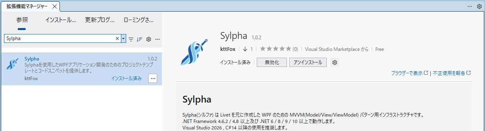
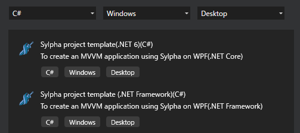
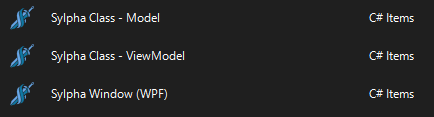

> **Note:** This file was translated using AI.

# Sylpha

[日本語版はこちら](README.md)


Sylpha is an MVVM (Model/View/ViewModel) pattern infrastructure for WPF, created based on [Livet](https://github.com/runceel/Livet).  
It supports .NET Framework 4.6.2 / 4.8 and above, as well as .NET 6 / 8 / 9 / 10 and above.  
Visual Studio 2026 and C# 14 or later is recommended.

## Installation
Available on NuGet.

- [Sylpha](https://www.nuget.org/packages/Sylpha/)

Alternatively, feature-specific packages are available for using only specific functionalities.  
- [Sylpha.EventListeners](https://www.nuget.org/packages/Sylpha.EventListeners)
- [Sylpha.Messaging](https://www.nuget.org/packages/Sylpha.Messaging)
- [Sylpha.Messaging.Extensions](https://www.nuget.org/packages/Sylpha.Messaging.Extensions)

#### Dependencies


### Visual Studio Support

Like Livet, Sylpha provides Visual Studio extensions.  
The extension provides project templates, item templates, and code snippets.  
[Sylpha (Visual Studio Extensions)](https://marketplace.visualstudio.com/items?itemName=kttFox.Sylpha)



#### Project Templates

- Sylpha WPF Application (.NET6)
- Sylpha WPF Application (.NET Framework)

#### Item Templates

- Sylpha Window (WPF)
- Sylpha Class - Model
- Sylpha Class - ViewModel


#### Code Snippets
- scom : DelegateCommand
- scomn : DelegateCommand (without CanExecute)
- scomx : DelegateCommand&lt;T&gt; (with parameter)
- scomxn : DelegateCommand&lt;T&gt; (with parameter, without CanExecute)
- sprop : Notification Property (change notification property)

Uses the field keyword.

## View Support

The Sylpha View namespace is `http://schemas.sylpha.com/wpf/mvvm`.
```xml
<Window
	xmlns:s="http://schemas.sylpha.com/wpf/mvvm">
```

### MessageAction

Sylpha provides MessageAction that can receive messages sent from Sylpha's Messenger and other sources.  
This MessageAction can not only receive messages from the Messenger but also be triggered from EventTrigger and similar sources.  
This allows you to display another window or show a message box triggered by click events, all within the View's XAML.

For messages with return values (such as MessageBoxMessage), it also supports calling ViewModel methods or commands with the return value as an argument.

#### CallMethodAction
Invokes methods.  
Searches for methods of the corresponding type using reflection.

Using CallMethodAction allows you to invoke methods in response to events.

#### Action to call ViewModel methods from View events

You can pass one argument to a method using the MethodParameter property.  
**In Sylpha, when you want to pass Null to MethodParameter, the MethodParameterType property has been added to provide type information.**

```xml
<Button Content="Call ViewModel method - ButtonClick with param">
	<i:Interaction.Triggers>
		<i:EventTrigger EventName="Click">
			<s:CallMethodAction MethodName="ButtonClick"
								 MethodParameter="TextParam"
								 MethodTarget="{Binding}" />
		</i:EventTrigger>
	</i:Interaction.Triggers>
</Button>

<!-- MethodParameterType -->
<Button Content="Call ViewModel method - ButtonClick( null )">
	<i:Interaction.Triggers>
		<i:EventTrigger EventName="Click">
			<s:CallMethodAction xmlns:sys="clr-namespace:System;assembly=mscorlib"
								 MethodName="ButtonClick"
								 MethodParameter="{x:Null}"
								 MethodParameterType="{x:Type sys:String}"
								 MethodTarget="{Binding .}" />
		</i:EventTrigger>
	</i:Interaction.Triggers>
</Button>
```
```cs
void ButtonClick( string? param ) {
	this.Text = $"[{DateTime.Now}] ViewModel - Button Clicked with param: {param ?? "null"}";
}
```

#### DirectMessage
Used when defining messages directly from the View.

When you want to define messages in the View, specify [DirectMessage] -> [corresponding Message] in sequence for MessageAction.  
By using DirectMessage, you can call methods like CallMethodAction.  

For example, to show a confirmation dialog when a button is clicked:
```xml
<Button Content="MessageBoxFromView">
	<i:Interaction.Triggers>
		<i:EventTrigger EventName="Click">
			<s:MessageBoxMessageAction>
				<s:DirectMessage CallbackMethodName="MessageBoxFromView" CallbackMethodTarget="{Binding}">
					<s:MessageBoxMessage Caption="Test" Text="This is a test message." />
				</s:DirectMessage>
			</s:MessageBoxMessageAction>
		</i:EventTrigger>
	</i:Interaction.Triggers>
</Button>
```
In the above example, the ViewModel's MessageBoxFromView method is specified to be called after the MessageAction executes.  
The MessageBoxFromView method receives MessageBoxMessage as an argument for processing.

```cs
public void MessageBoxFromView( MessageBoxMessage message ) {
	OutputMessage = $"{DateTime.Now}: MessageBoxFromView: {message.Response}";
}
```

### Messenger

Sylpha's Messenger is used the same way as Livet's, but has been improved for more intuitive use.

To use the Messenger, first specify MessageTrigger and MessageAction in the View.

```xml
<s:MessageTrigger MessageKey="MessageKey_MsgBox" Messenger="{Binding Messenger}">
	<s:MessageBoxMessageAction />
</s:MessageTrigger>
```

Then, send messages using the Messenger from the ViewModel.

```cs
public void MessageBoxFromViewModel() {
	var message = new MessageBoxMessage( "This is a test message.", "Test" ) {
		Button = MessageBoxButton.OKCancel,
		MessageKey = "MessageKey_MsgBox",
	};
	Messenger.Raise( message );
	OutputMessage = $"[{DateTime.Now}]: MessageBoxFromViewModel: {message.Response}";
}
```

MessageTrigger triggers the MessageAction using "MessageKey_MsgBox" as the message key identifier.

#### Sylpha.Messaging
The standard action and message combinations defined in Sylpha are as follows:  
|MessageAction|Message|Description|
|:---|:---|:---|
|MessageBoxMessageAction|MessageBoxMessage|Message box|
|ShowWindowMessageAction|ShowWindowMessage|Window navigation|
|OpenFileDialogMessageAction|OpenFileDialogMessage|Open file dialog|
|OpenFolderDialogMessageAction|OpenFolderDialogMessage|Folder selection dialog (.NET8 and later)|
|SaveFileDialogMessageAction|SaveFileDialogMessage|Save file dialog|
|WindowActionMessageAction|WindowActionMessage|Window maximize, minimize, close, etc.|
|CallMethodAction|CallActionMessage<br>CallActionMessage&lt;TResult&gt;<br>CallFuncMessage&lt;TParameter&gt;<br>CallFuncMessage&lt;TParameter, TResult&gt;|Function invocation|

#### Sylpha.Messaging.Extensions
Packaged separately because it uses Windows API Code Pack.
|MessageAction|Message|Description|
|:---|:---|:---|
|CommonOpenFileDialogMessageAction|CommonOpenFileDialogMessage|Folder selection dialog|

### MultiMessageAction

A MultiMessageAction covering all standard Sylpha actions has been created.  
By defining it as standard on a Window, you can save the trouble of setting up MessageActions.  

Since MessageAction and Message are paired, the need for MessageKey is minimal, and using this is recommended.

```xml
<s:MessageTrigger Messenger="{Binding Messenger}">
	<s:MultiMessageAction />
</s:MessageTrigger>
```

### Messenger Extension Methods
In Livet, Messenger.Raise() or Messenger.GetResponse() was the standard for sending messages to the Messenger.  
In Sylpha, Messenger.Raise() returns the sent Message, unifying to Raise().  

Furthermore, by adding extension methods to the Messenger for each defined Message, we've minimized the use of Raise().
```cs
// Standard
Messenger.Raise( new MessageBoxMessage( "hello" ) )

// MessageBoxMessage extension method
Messenger.MessageBox( new MessageBoxMessage( "hello" ) )
```
Using these extension methods allows you to avoid confusion about which Message class to pass to Raise() and properly distinguish whether there's a return value.


### Initialize / DataContextDisposeAction
Like Livet, Sylpha supports two events in the Window class initial setup.

The ContentRendered event is set to the ViewModel's Initialize method.  
In Livet, you needed to provide Initialize, but in Sylpha, it's defined as a virtual method in ViewModel, so you can use it simply by overriding.

The Closed event is set to DataContextDisposeAction.  
ViewModel has a DisposableCollection property for EventListener and other resources to be disposed, and since it inherits IDisposable, it needs to be disposed.  
This is the setting to dispose the ViewModel.

```xml
<Window xmlns:i="http://schemas.microsoft.com/xaml/behaviors"
		xmlns:s="http://schemas.sylpha.com/wpf/mvvm">
	<i:Interaction.Triggers>
		<i:EventTrigger EventName="ContentRendered">
			<s:CallMethodAction MethodName="Initialize"
								MethodTarget="{Binding}" />
		</i:EventTrigger>

		<i:EventTrigger EventName="Closed">
			<s:DataContextDisposeAction />
		</i:EventTrigger>
	</i:Interaction.Triggers>
</Window>
```

## ViewModel Support

### Messenger and DisposableCollection Property

As explained in the View Support section above, Messenger is provided to communicate messages from ViewModel to MessageAction.  
The Messenger's DisposableCollection property inherits from Collection&lt;IDisposable&gt; and is used to store resources that should be disposed when the ViewModel is disposed.

Resources that should be disposed together with the ViewModel should basically be added to the ViewModel's DisposableCollection property.

```cs
DisposableCollection.Add( someResource );
// or
someResource.AddTo( DisposableCollection );
```

### EventListener&lt;THandler&gt;
ViewModels often need to monitor Model events.  
However, there's a problem in C# where event handlers registered with lambda expressions cannot be unsubscribed.

```cs
// Cannot unsubscribe
var model = new Model();
model.SampleEvent += (s, e) => {
	// Processing
};
```

To solve this problem, a generic EventListener&lt;THandler&gt; that wraps event subscription/unsubscription and lambda expressions is provided.

```cs
var model = new Model();
var listener = new EventListener<EventHandler<SampleEventArgs>>(
	h => model.SampleEvent += h,
	h => model.SampleEvent -= h,
	(s, e) => {
		// Processing
	});

// Unsubscribe
listener.Dispose();
```

### PropertyChangedEventListener
For property change (INotifyPropertyChanged) events

```cs
var model = new Model(); // INotifyPropertyChanged
var listener = new PropertyChangedEventListener( model ) {
	// Can be specified with collection initializer
	
	// Processing for PropertyChanged event without specifying property name
	(s, e) => { /* Processing */ },
	
	// Set event handler with property name
	{ nameof(Model.Input1), (s, e) => { /* Processing */ } },

	// Set property name using expression tree
	{ () => model.Input2, (s, e) => { /* Processing */ } },
};

// Individual registration is also possible
listener.RegisterHandler((s, e) => { });
listener.RegisterHandler(nameof(Model.Input1), (s, e) => { });
listener.RegisterHandler(nameof(Model.Input1), (s, e) => { }, (s, e) => { }); // Multiple handlers allowed
listener.RegisterHandler(() => model.Input2, (s, e) => { });
listener.RegisterHandler(() => model.Input2, (s, e) => { }, (s, e) => { }); // Multiple handlers allowed

// Unsubscribe (use DisposableCollection mentioned above when unsubscribing on ViewModel disposal)
listener.Dispose();
```

### CollectionChangedEventListener
For collection change notification (INotifyCollectionChanged) events

```cs
var model = new Model(); // INotifyCollectionChanged
var listener = new CollectionChangedEventListener( model ) {
	// Set event handler for all actions
	( sender, e ) => { },

	// Set event handler for specific action
	{ NotifyCollectionChangedAction.Add, (s,e)=>{ } },
	{ NotifyCollectionChangedAction.Add, [(s,e)=>{ }, (s,e)=>{ }] }, // Multiple handlers allowed
};

listener.RegisterHandler((s, e) => { });
listener.RegisterHandler(NotifyCollectionChangedAction.Add, (s, e) => { });
listener.RegisterHandler(NotifyCollectionChangedAction.Add, (s, e) => { }, (s, e) => { }); // Multiple handlers allowed

// Unsubscribe
listener.Dispose();
```

## WeakEventListener&lt;THandler, TEventArgs&gt;
In Sylpha, WeakEventListener has been modified to minimize remaining references as much as possible.

- WeakEventListener&lt;THandler, TEventArgs&gt;
- PropertyChangedWeakEventListener
- CollectionChangedWeakEventListener

WeakEventListener is designed to be accident-resistant even if you forget to Dispose.  
As the name "Weak" suggests, it's an EventListener that incorporates weak references.  
By making the event target and the event handler parts weak references, it prevents the event handler from executing when the target is released.

In Livet, the actual event unsubscription wasn't performed, causing a slight memory leak-like situation.  
Sylpha's WeakEventListener has been changed to execute unsubscription processing on events that occur after the target is released.

## MessageListener
This existed since Livet but was hidden without documentation.  
MessageListener detects Messenger receive events and executes registered functions.

This is recommended when you want to handle Messenger receive events in code.
```cs
new MessageListener( messanger ) { 
	m => { /* Some processing */ }
 }
```

## Command
Sylpha's Command provides DelegateCommand and DelegateCommand&lt;T&gt;.  
It conforms to ICommand.  
The CurrentCanExecute property holds the result of the last CanExecute execution.

Sylpha extension provides code snippets.
- scom : DelegateCommand
- scomn : DelegateCommand (without CanExecute)
- scomx : DelegateCommand&lt;T&gt; (with parameter)
- scomxn : DelegateCommand&lt;T&gt; (with parameter, without CanExecute)


## Model Support

Like Livet, Sylpha uses NotificationObject for Models.  
NotificationObject is also inherited by the ViewModel class, so the content explained here can also be used in ViewModels.  
  
NotificationObject has the following methods defined to simplify property definitions.

#### SetProperty
Updates the field and raises the PropertyChanged event.  
Using this method, property definitions look like this.  
Using the field keyword introduced in C# 14 allows for concise notation.

This property definition can be generated with the sprop code snippet.
```cs
public string MyProperty { get; set => SetProperty( ref field, value ); }
```

#### RaisePropertyChanged Method

Raises PropertyChanged event with the specified property name.

```cs
public string MyProperty {
	get;
	set {
		if( field != value ) {
			field = value;
			RaisePropertyChanged(); // Property name is automatically set by CallerMemberName
			
			// You can also specify explicitly.
			RaisePropertyChanged( nameof( MyProperty ) );
			RaisePropertyChanged( ()=> MyProperty );
		}
	}
}
```
Or use it to raise events for other properties.
```cs
public string MyProperty {
	get; set {
		if( SetProperty( ref field, value ) ){
			RaisePropertyChanged( nameof( Text ) );
		}
	}
}

public string Text => MyProperty + " Changed";
```

## Others

### Thread-Safe and UI Thread Support Removed
Sylpha has removed thread-safe processing and UI thread check processing.  
In Livet, this processing was performed in Command and Messenger, but it has been discontinued as processing is basically done on the UI thread.

Therefore, in Sylpha, always send Messages to Messenger from the UI thread.

### RestoreDirectoryGroup

Added functionality to remember the last opened directory in file and folder selection dialogs.
- OpenFileDialogMessage
- OpenFolderDialogMessage (.NET8 and later)
- SaveFileDialogMessage
- CommonOpenFileDialogMessage (Sylpha.Messaging.Extension)

Setting a string key in the Message's RestoreDirectoryGroup property will remember and restore the confirmed dialog's directory.

This is similar functionality to the RestoreDirectory property in WinForm's OpenFileDialog.

<br/>
<br/>

## Changes from Livet

Sylpha is created based on [Livet v4.0.2](https://github.com/runceel/Livet/tree/v4.0.2).

### Added
+ Added Nullable support
+ Added RestoreDirectoryGroup functionality
+ Added MultiMessageAction
+ Added extension methods for each Message to Messenger
+ Added virtual Initialize() to ViewModel
+ Added AddTo() extension method for IDisposable

### Changed

+ Unified commands from ListenerCommand, ViewModelCommand to DelegateCommand
+ Simplified namespaces around Sylpha.Messaging
+ Changed CallMethodAction to support 4 patterns: with/without parameters, with/without return value
+ Improved WeakEventListener
+ Changed code snippets to use the field keyword

### Removed
+ Removed thread-safe support
+ Removed UI thread support<br/>
DispatcherHelper, etc.
+ Removed RaisePropertyChangedIfSet method from NotificationObject
+ Removed the word "Interaction"<br/>
[Example] InteractionMessage -> Message
+ Removed InvokeActionOnlyWhenWindowIsActive property from InteractionMessageAction&lt;T&gt;
+ Removed InvokeActionsOnlyWhileAttatchedObjectLoaded, IsEnable properties from InteractionMessageTrigger
+ Removed WinForms FolderBrowserDialog support
+ Removed projects under the following namespaces<br/>
LivetCask2<br/>
LivetCask.Collections<br/>
LivetCask.StatefulModel<br/>
LivetCask.Behaviors<br/>
LivetCask.Converters<br/>


## Acknowledgements

This project is based on the excellent work of the original library ([Livet](https://github.com/runceel/Livet)) author.  
We sincerely thank them for publishing such a useful library.
